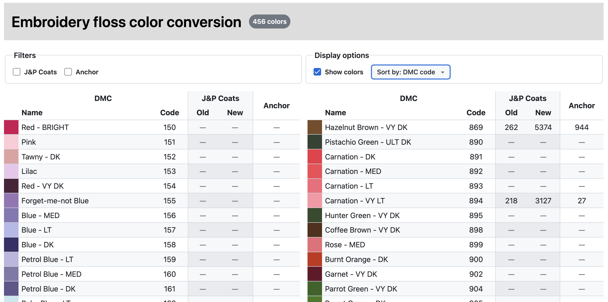

# Printer-friendly cross stitch floss color conversion table

See [releases](https://github.com/cheshire137/cross-stitch-color-conversion/releases) for downloadable PDFs in black and white and color format.



## How to develop

```sh
npm install
npm run dev
```

Other commands:

- Auto-format code: `npm run format`
- Run TypeScript type checker: `npm run tsc`

## Thanks

Thanks to these data sources for color equivalents across brands:

- Old + new J&P Coats / DMC / Anchor color codes from
    - [Cross Stitchers Unite](https://www.oocities.org/anna_merchant/6.txt)
    - [Goblenart](https://www.goblenart.com/old-jpcoats-new-jpcoats-dmc-anchor-conversion-chart/)
- Anchor / DMC color codes from [Stitchtastic](https://www.stitchtastic.com/blog/stch/anchor-to-dmc-threads-conversion-chart/)
- DMC color codes and names from [camelia.sk](http://www.camelia.sk/dmc_1.htm)
- Cosmo / DMC color codes from [Snuggly Monkey](https://www.snugglymonkey.com/blogs/news/converting-dmc-to-cosmo-embroidery-floss)
