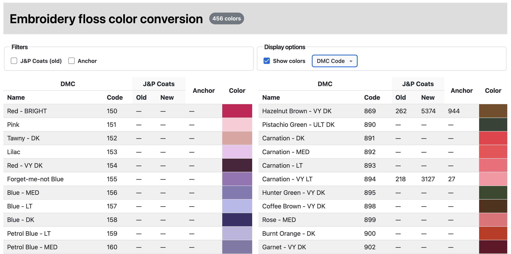

## Printer-friendly color conversion table



### How to develop

```sh
npm install
npm run dev
```

Other commands:

- Auto-format code: `npm run format`
- Run TypeScript type checker: `npm run tsc`
- Build the app and deploy to GitHub Pages: `./deploy.sh`
